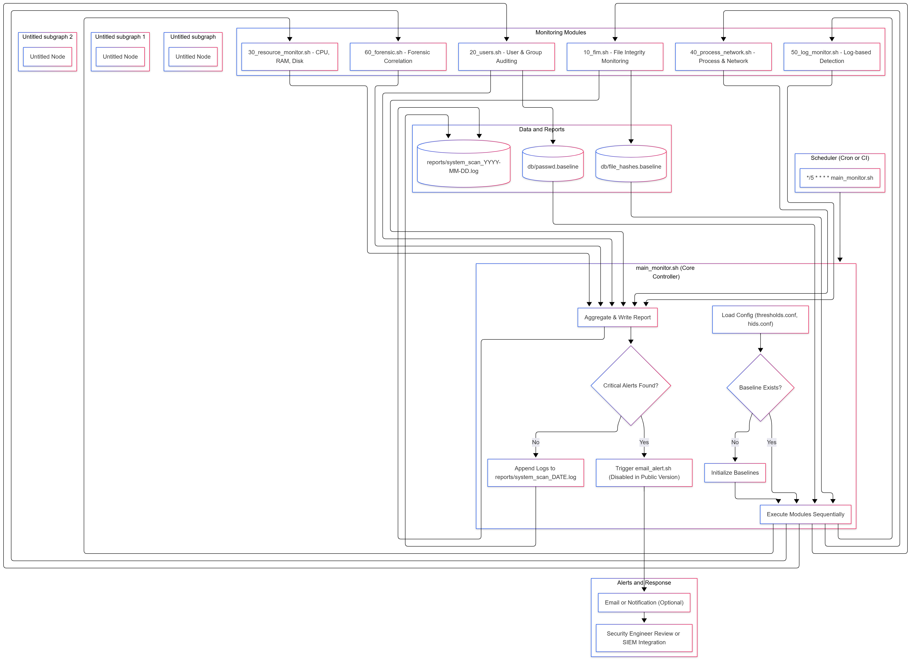
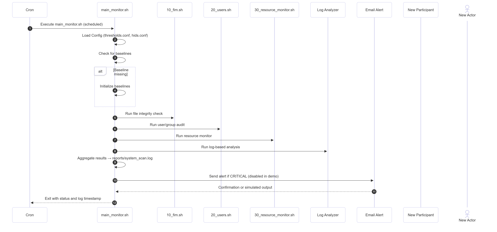

🛡️ HIDS-Toolkit — Linux Host-based Intrusion Detection System

## 📘 Overview
**HIDS-Toolkit** is a Bash-based Host Intrusion Detection System (HIDS) simulation for Linux environments.  
It monitors, detects, and reports suspicious activity using only **native system tools**, demonstrating how host-based detection can be implemented without third-party dependencies.

This project showcases real-world cybersecurity concepts such as:
- Resource and system monitoring  
- File integrity verification  
- User auditing  
- Process and network inspection  
- Log-based threat detection  
- Automated alerting and forensics  

## 🎯 Project Mission
Develop a **modular, lightweight Linux HIDS** that performs:
- Continuous host monitoring  
- Anomaly detection  
- Forensic logging and alerting  
All powered by **Bash** and **cron automation**, using only built-in Linux utilities.

---

## 🧠 Learning Goals
This academic project was designed to strengthen:
- Advanced Linux administration and shell scripting  
- Modular Bash architecture design  
- Real-time log monitoring and alerting  
- Forensic correlation and reporting  
- Secure configuration management  
- Privacy-conscious system auditing  

---

## ⚙️ Core Features

| **Feature** | **Description** | **Tools Used** |
|--------------|-----------------|----------------|
| **System Resource Monitoring** | Monitors CPU, RAM, and Disk usage; alerts on threshold breaches | `uptime`, `free -m`, `df -h` |
| **File Integrity Monitoring (FIM)** | Detects unauthorized file changes using SHA256 hashing | `sha256sum`, `diff` |
| **User & Group Auditing** | Detects unauthorized user/group modifications | `awk`, `diff`, `/etc/passwd` |
| **Process & Network Scanning** | Flags suspicious processes and open ports | `ps aux`, `ss -tuln` |
| **Log-Based Detection** | Identifies brute-force, failed logins, root access, and sudo abuse | `grep`, `/var/log/auth.log`, `/var/log/syslog` |
| **Forensic Log Analysis** | Correlates events across multiple logs for investigations | `awk`, `grep`, `log_analyzer.sh` |
| **Automated Alerts** | Sends (or simulates) email alerts on critical findings | `email_alert.sh`, `ssmtp` |
| **Cron Automation** | Runs every 5 minutes for proactive detection | `cron`, `main_monitor.sh` |

---

## 🧭 HIDS Toolkit — Architecture & Logic Overview

### 🔧 System Logic Diagram
The diagram below illustrates the logical architecture of the HIDS Toolkit — how each component (cron, controller, modules, and storage) interact during system monitoring and alerting.

---

### 🔄 Execution Sequence Diagram
This sequence diagram shows how the monitoring process flows:  
from cron scheduling → to `main_monitor.sh` → to the modules → and finally to reporting and alerting.

 Getting Started

1️⃣ Clone the Repository

git clone https://github.com/<your-username>/hids-toolkit.git
cd hids-toolkit

2️⃣ Make Scripts Executable

chmod +x *.sh modules/*.sh

3️⃣ Configure Settings
Edit:

config/thresholds.conf – alert thresholds

config/hids.conf – directories and ports

config/email.conf – local alert email (use example template)

4️⃣ Run a Module Manually

./modules/30_resource_monitor.sh --test

5️⃣ Schedule via Cron (optional)

crontab -e
*/5 * * * * /full/path/to/main_monitor.sh >> /var/log/main_monitor_cron.log 2>&1

🧪 Example Report Output
===== Resource Monitor run at: 2025-10-27 09:30:00 =====
OK: CPU 15-min load 0.35
OK: Memory usage 45%
OK: Disk / usage 42%

===== HIDS Alerts Summary =====
[INFO] 2025-10-27 09:31:10 - 5 failed SSH login attempts from 192.168.1.25
[WARNING] 2025-10-27 09:32:12 - Unauthorized port open: 8081
[CRITICAL] 2025-10-27 09:33:20 - File integrity changed: /etc/sample.conf

(All data sanitized for privacy and demonstration purposes.)

🔒 Security & Privacy Notes

No real logs or credentials are included.

All IPs and usernames are anonymized.

Credentials should be stored using environment variables or secrets managers.

.gitignore ensures config/email.conf and live reports stay private.

🧩 Educational Value

This project demonstrates:

Host-based security monitoring using native Linux tools

Modular Bash scripting & automation design

Log correlation and forensic analysis principles

Alert automation and basic incident response simulation

Secure coding and configuration management awareness

🧠 Future Application — GRC & Security Engineering

This project laid the foundation for how I would apply my skills professionally in Governance, Risk, and Compliance (GRC) and Security Engineering:

🧩 In Security Engineering

Threat Detection & Response Design: I can build and tune detection logic for Linux servers, focusing on system behavior baselining and alert thresholds.

Endpoint Hardening & Monitoring: Apply FIM, process auditing, and log-based detection in enterprise host monitoring frameworks (e.g., Wazuh, OSSEC, or Elastic Agent).

Automation & DevSecOps: Integrate host-security checks into CI/CD or configuration-management pipelines.

Incident Response Support: Use similar scripts to extract forensic evidence or validate security baselines during investigations.

Alert Engineering: Translate findings into actionable events for SOC pipelines or SIEM ingestion.

🧭 In GRC / Risk Management

Control Validation: Map technical detections to frameworks like NIST 800-53, CIS Controls, and ISO 27001 Annex A (12, 13).

Compliance Automation: Adapt Bash checks to support evidence collection for compliance audits.

Policy-to-Control Mapping: Show how system-level detections align with defined organizational security controls.

Reporting & Metrics: Generate automated compliance status reports using sanitized system data.

💼 Long-Term Vision

This toolkit demonstrates my ability to bridge the gap between technical detection engineering and governance & compliance, translating operational security into measurable, reportable controls.

🧾 Source Code Availability

The complete codebase (all scripts and modules) is available on request for academic, evaluation, or professional review.
Please contact me directly for a private demonstration or code walkthrough.

⚠️ Only sanitized versions of configuration and report files are public for security reasons.

📨 Contact
GitHub: (https://github.com/asi-im-bir)

✅ Summary Statement
HIDS-Toolkit demonstrates how native Linux tools can deliver real-time detection, forensic analysis, and compliance-aligned monitoring — bridging the gap between technical security engineering and GRC automation.
